# CS-MADA Workspace: Target Domain Model

## Operating boundary

CS-MADA and MADA-OPS are internal teams with authenticated members. SEZ-OPS is an external operational dependency. It has no CS-MADA account, team membership, queue, or system permissions. Internal staff own the case and every follow-up while an external escalation is open.

## Entities and relationships

| Entity | Purpose |
| --- | --- |
| `cases` | Customer query, identity/contact, channel, category, carrier, priority, owner, current internal team/assignee, lifecycle status, separate deadlines, and timestamps. |
| `case_categories` | Extensible category catalog, seeded with Delivery, Payment link, Parcel update/status, and Urgent requests. |
| `agents` | Internal application identities linked to Supabase Auth. |
| `teams` | Internal teams only: CS-MADA and MADA-OPS. |
| `team_memberships` | Many-to-many agent/team membership, allowing Fania to work in both teams. |
| `routing_rules` | Configurable channel/team/carrier rules and candidate assignee or pool; rules are data, not React conditionals. |
| `case_escalations` | One durable row per Tier 1 or Tier 2 handoff, including source, destination, reason, requested action, notes, owner, due times, responses, and state. |
| `case_events` | Append-only audit history with actor and team snapshots, event type, message, metadata, and timestamp. |
| `customer_updates` | Typed customer-facing communications with channel, author, content, sent time, and promised next update. |
| `notifications` | Idempotent event-driven internal notification with recipient, case, type, priority, and read state. |
| `notification_preferences` / `webpush_subscriptions` | Per-agent notification settings and browser push endpoints. |

### Ownership invariants

- `case_owner_id` tracks the internal CS-MADA agent accountable for customer communication. It normally persists through operational handoffs.
- `current_team_id` references an internal team only: CS-MADA or MADA-OPS.
- `current_assignee_id` references an internal agent expected to take the next action.
- `current_escalation_tier` is None, Tier 1, or Tier 2; it does not identify a team or assignee.
- Tier 2 escalation has `external_destination = 'SEZ-OPS'`, no internal destination team or external user ID, and a required `internal_followup_owner_id`.
- Customer update, Tier 1 response, Tier 2 follow-up, and resolution deadlines are separate timestamps.

## Case state

Status values: New, In progress, Waiting on Customer, Waiting on Operations, Waiting on External Operations, Resolved, Closed.

Escalation tier: None, Tier 1, Tier 2. External status is present only for Tier 2: Draft, Sent, Awaiting SEZ-OPS, Response received, Returned to CS-MADA, Resolved, Cancelled. These are independent dimensions; external status does not create an internal team.

Carriers begin with Aramex, Speedaf, Other, and Unknown. Categories and carriers should use reference/configuration records so new values do not require workflow rewrites.

## Workflow

```mermaid
flowchart LR
  Contact[Customer contact: WhatsApp or Email] --> Intake[Create case and apply routing rule]
  Intake --> CS[CS-MADA: case owner and customer communication]
  CS --> Triage[Triage: category, carrier, priority, next customer update]
  Triage -->|Can resolve| CustomerUpdate[Customer update]
  CustomerUpdate --> Resolved[Resolved / Closed]
  Triage -->|Needs internal operations| Tier1[Tier 1 escalation record]
  Tier1 --> Ops[MADA-OPS: acknowledge, work, respond]
  Ops -->|Answer/action complete| Return[Return case to CS-MADA]
  Return --> CustomerUpdate
  Ops -->|External dependency needed| Tier2[Tier 2 external handoff record]
  Tier2 --> SEZ[SEZ-OPS external process]
  SEZ --> Record[Internal user records SEZ-OPS response]
  Record --> Followup[MADA-OPS / CS-MADA follow-up]
  Followup --> CustomerUpdate
```

Every box transition that changes case state or records a handoff appends a case event. A case may have multiple escalation records over time. The workflow does not require every case to pass through every escalation tier.

## Transition and audit rules

| Action | State effect | Required audit/notification |
| --- | --- | --- |
| Create case | New; route to CS-MADA based on WhatsApp/Email rule; set case owner and assignee | `case_created`; notify assigned internal agent/team |
| Triage/edit classification | Update category, carrier, priority | Typed field-change events with before/after metadata |
| Escalate to MADA-OPS | Create Tier 1 escalation; set team MADA-OPS, assignee from carrier rule, status Waiting on Operations | `tier1_escalated`; notify destination assignee |
| Acknowledge/reassign/respond Tier 1 | Update the escalation instance and operational response | Separate acknowledge, reassignment, and response events; notify case owner on response |
| Return to CS-MADA | Set internal team CS-MADA, assignee to case owner or selected CS member, status In progress | `returned_to_cs`; notify case owner |
| Escalate to SEZ-OPS | Create Tier 2 escalation with external destination, internal follow-up owner, sent/follow-up times; status Waiting on External Operations | `tier2_external_sent`; notify internal follow-up owner and relevant case staff |
| Record SEZ-OPS response | Update external status Response received; preserve receiving internal agent, response content, instructions, references, next action | `external_response_received`; notify case owner/current internal assignee |
| Customer update | Append typed communication and update last/next customer update times | `customer_update_sent`; clear/refresh deadline notifications |
| Resolve/reopen/close | Change lifecycle status; preserve all prior events and escalations | Corresponding status event and relevant notifications |

Events should be inserted by transactional database functions or a trusted server layer. Authenticated clients must not update or delete prior event rows. System-generated events may have a null actor with an explicit system actor label.

## Routing rules

Initial defaults:

| Condition | Internal team | Owner/assignee behavior |
| --- | --- | --- |
| New WhatsApp contact | CS-MADA | Route owner/assignee to configured Rojo identity |
| New Email contact | CS-MADA | Route owner/assignee to configured Fania identity |
| Tier 1 + Aramex | MADA-OPS | Configured Jerry/Ando pool or selected member |
| Tier 1 + Speedaf | MADA-OPS | Configured Fania identity |
| Tier 1 + Other/Unknown | MADA-OPS | Configured fallback assignment/pool |
| Tier 2 | No external team row | External destination SEZ-OPS plus required internal follow-up owner |

Names are configuration examples from the operating brief. Resolve them to real agent/auth records during deployment; never seed fabricated auth IDs. Routing-rule changes should be audited and restricted to admins.

## Permission model

- CS-MADA: intake/classify, customer updates, Tier 1 initiation, review responses, external details, resolve/reopen/close.
- MADA-OPS: Tier 1 acknowledgment and work, assignment, internal notes, operational response, return to CS, Tier 2 handoff, SEZ-OPS response recording.
- Admin: internal configuration, routing, memberships, reporting, and full case access.
- SEZ-OPS: no principal, application role, login, or direct access.

Enforce identity and team membership in Supabase RLS and privileged transition functions. Frontend controls are for usability only. Restrict event writes to validated server functions, and make event updates/deletes unavailable to normal application roles. Notification recipients must be internal agents with valid auth mappings.

## Notification rules

Create idempotent internal notifications for new assignment, Tier 1 assignment/acknowledgment/due, Operations response, return to CS, Tier 2 handoff/follow-up due, SEZ-OPS response recorded, customer update due/overdue, reopening, and other configured case changes. Each includes event type, priority, reference, meaningful summary, and case link. No notification is sent to SEZ-OPS. Deadline notifications require a scheduled server-side process for reliable delivery while the browser is closed.

## Migration principles

- Preserve existing `demandes` IDs, customer/contact/query fields, channel, owner/responsible references, timestamps, and every `demande_events` row.
- Map owner to Case Owner and responsible to Current Assignee; infer Current Team only where legacy stage/agent evidence is clear.
- Map customer feedback deadline to customer-update deadline. Do not collapse it with operational or resolution deadlines.
- Mark synthesized historical escalations as legacy/inferred and leave unsupported values unknown. Do not fabricate category, carrier, Tier 2 activity, response, or deadline.
- Add and backfill in parallel, reconcile counts/IDs/history, verify auth mappings and new RLS, then switch application reads/writes. Delay legacy column/table removal until rollback is no longer needed.
- Inspect production schema, data, auth roster, RLS, triggers, and Realtime publication before applying DDL; repository SQL alone is not a production snapshot.
